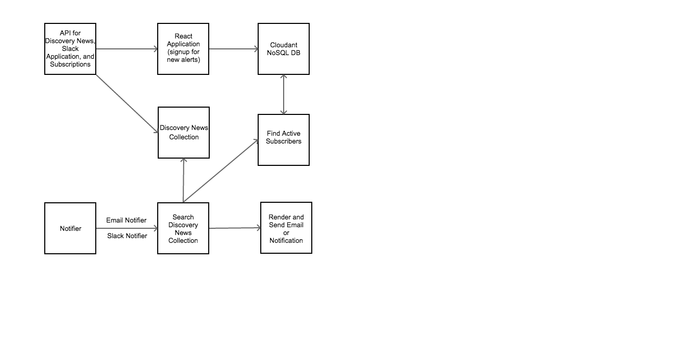
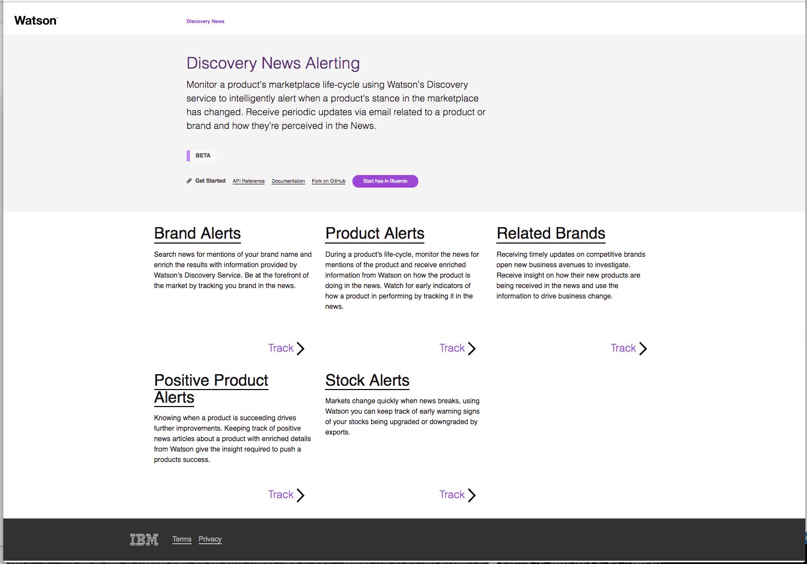
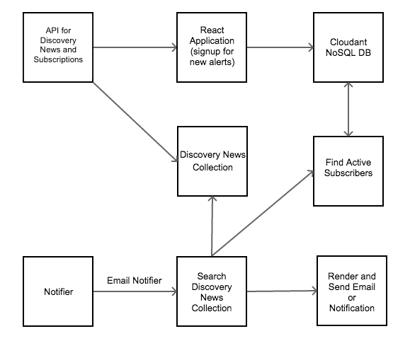

[](https://travis-ci.org/IBM/watson-discovery-news-alerting)

# Watson Discovery News Alerting

In this Code Pattern, we will build a Node.js web application that will use the Watson Discovery Service to access Watson Discovery News.

Watson Discovery News is a default data collection that is associated with the Watson Discovery Service. It is a dataset of primarily English language news sources that is updated continuously, with approximately 300,000 new articles and blogs added daily.

The focus of this Code Pattern is to monitor a product's marketplace life-cycle using Watson's Discovery service to intelligently alert when a product's stance in the marketplace has changed. Users can recieve periodic email alerts about a product or brand and how they're perceived in the News.

Alert tracking can be set up for the following areas:
* The product
* The brand
* Related products and brands
* Positive or negative product sentiment
* Stock prices

The Code Pattern highlights the steps required to build a front-end management interface to search Watson News and a back-end service which periodically sends alerts out related to customizable queries.



## Flow

1. The user interacts with the backend server via the app UI. The frontend app UI uses React to render search results and can reuse all of the views that are used by the backend for server side rendering. The frontend is using watson-react-components and is responsive.
2. User input is processed and routed to the backend server, which is responsible for server side rendering of the views to be displayed on the browser. The backend server is written using express and uses express-react-views engine to render views written using React.
3. The backend server stores subscription information in a Cloudant NonSQL database for product tracking.
4. The backend server sends user requests to the Watson Discovery Service. It acts as a proxy server, forwarding queries from the frontend to the Watson Discovery Service API while keeping sensitive API keys concealed from the user.
5. The Watson Discovery Service queries the Watson News Collection for articles related to the product.
6. The backend server sends periodic updates to email.

# Included components

* [Watson Discovery](https://www.ibm.com/watson/developercloud/discovery.html): A cognitive search and content analytics engine for applications to identify patterns, trens, and actionable insights.
* [Cloudant NoSQL DB for IBM Cloud](https://console.bluemix.net/docs/services/Cloudant/cloudant.html#overview): A fully managed data layer designed for modern web and mobile applications that leverages a flexible JSON schema.

# Featured technologies

* [Node.js](https://nodejs.org/en/) - An asynchronous event driven JavaScript runtime, designed to build scalable applications
* [React](https://facebook.github.io/react/) - Javascript library for building User Interfaces
* [Express](https://expressjs.com) - A popular and minimalistic web framework for creating API and Web server
* [Yarn](https://yarnpkg.com) - Fast, reliable and secure dependency manager for node.js

# Watch the Video

[](https://youtu.be/zFl-2FybDdY)

# Steps

1. [Clone the repo](#1-clone-the-repo)
2. [Create Watson Services with IBM Cloud](#2-create-watson-services-with-ibm-cloud)

## 1. Clone the repo

Clone the `watson-discovery-news-alerting` locally. In a terminal, run:
```
$ git clone https://github.com/ibm/watson-discovery-news-alerting
```

## 2. Create Watson Services with IBM Cloud

Create the following service:

  * [**Watson Discovery**](https://console.ng.bluemix.net/catalog/services/discovery) - name the service `wdna-discovery`
  * [**Cloudant NoSQL DB**](https://console.bluemix.net/catalog/services/cloudant-nosql-db) - name the service `wdna-cloudant`

## Run the application locally

1. Install [Node.js](https://nodejs.org/en/) and [Yarn](https://yarnpkg.com)
2. Install all of the dependencies by running `yarn`. This will install of the node modules specified in [`package.json`](package.json)
```
$ cd app
$ yarn
```
3. Copy the `env.sample` to `.env`
```
$ cp .env.sample .env
```
4. Edit the `.env` file and enter your Watson Discovery and Cloudant NoSQL DB credentials. Add SMTP Mail settings if you wish to use the tracking feature.
5. Build and start the main app.
```
$ yarn run build
$ yarn start
```
6. Build and start the tracking app.
```
$ yarn run start-notifier
```
6. Open a browser and go to `http://localhost:4391`

## Deploy and run the application on IBM Cloud

To deploy to IBM Cloud make sure you have the IBM Cloud CLI tool installed. Then run the following commands to connect it with IBM Cloud and login with your IBM Cloud credentials.

```sh
$ cd watson-discovery-news-alerting
$ ibmcloud login
```

Run the following command to deploy and run the alerting and notifier apps on the IBM Cloud. It will automatically connect to your existing Watson Discovery and Cloudant NoSQL DB services **if** your service names match the names specified in the `manifest.yml` file.

```sh
$ ibmcloud cf push
```

If the `ibmcloud cf push` command complains that the application name is already taken, change the lines in the `manifest.yml` to have a custom application name specific for your setup:

```yaml
...
applications:
- name: custom-name
  path: ./app
...
```
Two IBM Cloud applications should be created and running:
* watson-discovery-news-alerting
* watson-discovery-news-alerting-notifier

Set the environment variables required for each the notifier service to perform properly. Use the values unique to your setup:

```sh
$ ibmcloud cf set-env watson-discovery-news-alert-notifier SMTP_SETTINGS '{"host":"smtp.gmail.com","user":"xxx@gmail.com","pass":"xxx","fromEmail":"xxx@gmail.com"}'
$ ibmcloud cf set-env watson-discovery-news-alert-notifier BASE_URL 'https://watson-discovery-news-alerting.mybluemix.net'
```

Go to the URL route that is associated with the `watson-discovery-news-alerting` app in IBM Cloud to view the application. Typically, this would be `https://watson-discovery-news-alerting.mybluemix.net`.

# Sample output



# General Project Layout

The server which hosts the React web application, acts as an API to Watson, and communicates with the notifier App can be found at:

```
./app/server.js
```

The server which periodically emails news alerts to subscribed users can be found at:

```
./app/notifier.js
```



# Architecture

## Back-end Server

Handles hosting of the static assets (React front-end application) and manages a thin API used by the front-end application.

## Front-end Application

Displays results from querying the Watson Discovery Service API and manages subscriptions for push updates.

## Worker Application

Background process which periodically sends updates to email.

# Troubleshooting

* Setting environment variables for a local run in `.env` config file

The credentials for IBM Cloud services (wdna-discovery and wdna-cloudant) can
be found in the ``Services`` menu in IBM Cloud, and selecting the ``Service Credentials``
option.

* Ensure port is not already in use

If the port is unavailable, you will see the following error:

```
Error: listen EADDRINUSE :::{port}
```

# Links
* [Demo on Youtube](https://youtu.be/zFl-2FybDdY): Watch the video.
* [Watson Node.js SDK](https://github.com/watson-developer-cloud/node-sdk): Download the Watson Node SDK.
* [Watson News Queries Video](https://youtu.be/N-HaIpPGde0): Watch how we created the queries for this Code Pattern.
* [Cognitive discovery architecture](https://www.ibm.com/cloud/garage/content/architecture/cognitiveDiscoveryDomain): Learn how this Code Pattern fits into the Cognitive discovery Reference Architecture.
* [Watson Discovery Service Updates for News and NLP](https://www.ibm.com/blogs/bluemix/2017/08/watson-discovery-service-updates-news-nlp/): Learn what enhancements are being made to the service.
* [Watson Discovery Demo](https://discovery-news-demo.mybluemix.net/?cm_sp=dw-bluemix-_-code-_-devcenter): Unlock hidden value in data to find answers, monitor trends and surface patterns.
* [Watson Discovery News](https://console.bluemix.net/docs/services/discovery/watson-discovery-news.html#watson-discovery-news?cm_sp=dw-bluemix-_-code-_-devcenter): Explore the Watson Discovery News documentation.
* [Create a cognitive news search app](https://developer.ibm.com/code/journey/create-a-cognitive-news-search-app/): Follow along with a news search and trends web app journey.
* [Watson Discovery and Exploration blog-1](https://www.ibm.com/blogs/watson/2017/04/box-discovery-provides-pre-enriched-collection-2-months-internet-news-content/): Out of the box, Discovery provides a pre-enriched collection of 2 months of internet news content.
* [Watson Discovery and Exploration blog-2](https://www.ibm.com/blogs/watson/2017/07/how-enriched-and-faster-news-discovery-fuels-business-development-and-growth/): Find out how enriched and faster news discovery fuels business development and growth.
* [Watson Discovery configurataion](https://www.ibm.com/watson/developercloud/doc/discovery/building.html#understanding-the-difference-between-entities-concepts-and-keywords): Understanding the difference between entities, concepts, and keywords.
* [Recharts](http://recharts.org/): A composable charting library built on React components.
* [Ngrok](https://ngrok.com/): Establish secure tunnels from a public endpoint to a local host.
* [Jest](https://facebook.github.io/jest/): A JavaScript testing framework.

# Learn more

* **Artificial Intelligence Code Patterns**: Enjoyed this Code Pattern? Check out our other [AI Code Patterns](https://developer.ibm.com/code/technologies/artificial-intelligence/).
* **AI and Data Code Pattern Playlist**: Bookmark our [playlist](https://www.youtube.com/playlist?list=PLzUbsvIyrNfknNewObx5N7uGZ5FKH0Fde) with all of our Code Pattern videos
* **With Watson**: Want to take your Watson app to the next level? Looking to utilize Watson Brand assets? [Join the With Watson program](https://www.ibm.com/watson/with-watson/) to leverage exclusive brand, marketing, and tech resources to amplify and accelerate your Watson embedded commercial solution.

# License

[Apache 2.0](LICENSE)
