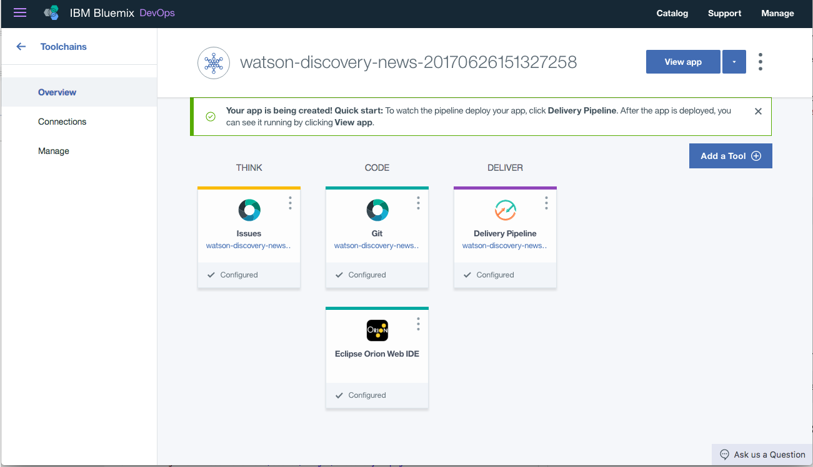
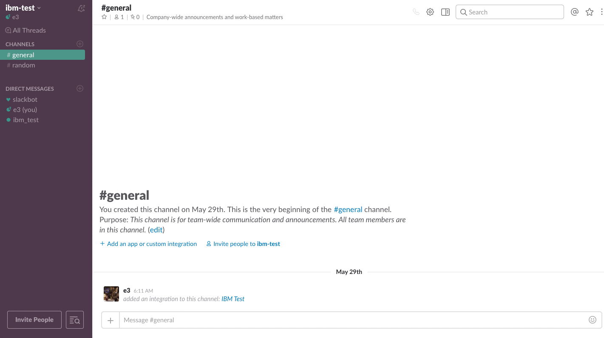

[](https://travis-ci.org/ibm/watson-discovery-news-alerting)


# Watson Discovery News Alerting 

In this developer journey, we will build a Node.js web application that will use the Watson Discovery Service to access Watson Discovery News.

Watson Discovery News is a default data collection that is associated with the Watson Discovery Service. It is a dataset of primarily English language news sources that is updated continuously, with approximately 300,000 new articles and blogs added daily.

The focus of this journey is to monitor a product's marketplace life-cycle using Watson's Discovery service to intelligently alert when a product's stance in the marketplace has changed. Users can recieve periodic email or Slack alerts about a product or brand and how they're perceived in the News.

Alert tracking can be set up for the following areas:
* The product
* The brand
* Related products and brands
* Positive or negative product sentiment
* Stock prices

The journey highlights the steps required to build a front-end management interface to search Watson News and a back-end service which periodically sends alerts out related to customizable queries.

** ARCHITECURE PICTURE **


## Flow

1. The user interacts with the backend server via the app UI. The frontend app UI uses React to render search results and can reuse all of the views that are used by the backend for server side rendering. The frontend is using watson-react-components and is responsive.
2. User input is processed and routed to the backend server, which is responsible for server side rendering of the views to be displayed on the browser. The backend server is written using express and uses express-react-views engine to render views written using React.
3. The backend server stores subscription information for product tracking.
4. The backend server sends user requests to the Watson Discovery Service. It acts as a proxy server, forwarding queries from the frontend to the Watson Discovery Service API while keeping sensitive API keys concealed from the user.
5. The Watson Discovery Service queries the Watson News Collection for articles related to the product.
6. The backend server sends periodic updates to Slack and/or email.

## With Watson

Want to take your Watson app to the next level? Looking to leverage Watson Brand assets? Join the [With Watson](https://www.ibm.com/watson/with-watson) program which provides exclusive brand, marketing, and tech resources to amplify and accelerate your Watson embedded commercial solution.

# Included components

* [Watson Discovery](https://www.ibm.com/watson/developercloud/discovery.html): A cognitive search and content analytics engine for applications to identify patterns, trens, and actionable insights.
* [Cloudant NoSQL DB for Bluemix](https://console.bluemix.net/docs/services/Cloudant/cloudant.html#overview): A fully managed data layer designed for modern web and mobile applications that leverages a flexible JSON schema.

# Featured technologies

* [Node.js](https://nodejs.org/en/) - An asynchronous event driven JavaScript runtime, designed to build scalable applications
* [React](https://facebook.github.io/react/) - Javascript library for building User Interfaces
* [Express](https://expressjs.com) - A popular and minimalistic web framework for creating API and Web server
* [Yarn](https://yarnpkg.com) - Fast, reliable and secure dependency manager for node.js
* [Slack](https://slack.com) - Slack is a cloud-based set of team collaboration tools and services with chat bot integration
* [Botkit](https://www.botkit.ai) - Framework for creating and managing chat bots

# Watch the Video

[](https://youtu.be/N-HaIpPGde0)

# Steps

Use the ``Deploy to Bluemix`` button **OR** create the services and run locally.

## Deploy to Bluemix
[](https://bluemix.net/deploy?repository=https://github.com/IBM/watson-discovery-news-alerting.git)

1. Press the above ``Deploy to Bluemix`` button and then click on ``Deploy``.

2. In Toolchains, click on Delivery Pipeline to watch while the app is deployed. Once deployed, the app can be viewed by clicking 'View app'.

<p align="center">
  
</p>

3. To see the app and services created and configured for this journey, use the Bluemix dashboard. The app is named `watson-discovery-news-alerting` with a unique suffix. The following services are created:
    * discovery-news-service

## Run locally
> NOTE: These steps are only needed when running locally instead of using the ``Deploy to Bluemix`` button.

1. [Clone the repo](#1-clone-the-repo)
2. [Create Bluemix services](#2-create-watson-services-with-ibm-bluemix)
3. [Configure Slack](#3-configure-slack)
4. [Run the application](#4-run-the-application)

## 1. Clone the repo

Clone the `watson-discovery-news-alerting` locally. In a terminal, run:
```
$ git clone https://github.com/ibm/watson-discovery-news-alerting
```

## 2. Create Watson Services with IBM Bluemix

Create the following service:

  * [**Watson Discovery**](https://console.ng.bluemix.net/catalog/services/discovery)
  * [**Cloudant NoSQL DB**](https://console.bluemix.net/catalog/services/cloudant-nosql-db)

## 3. Configure Slack

To integrate a new Slack Bot into your existing Slack team, navigate to https://my.slack.com/services/new/bot. Enter a username for the bot and click **Add bot integration**.

<p align="center">
  
</p>

Once created, save the **API Token** that is generated.

<p align="center">
  
</p>

## 4. Run the application

### If you used the Deploy to Bluemix button...

If you used ``Deploy to Bluemix``, most of the setup is automatic, but not
quite all of it. We have to update a few environment variables.

In the Bluemix dashboard find the App that was created. Click on ``Runtime`` on the menu and navigate to the ``Environment variables`` tab.


Update the following environment variable:

  * Set ``SLACK_API_TOKEN`` to the token you created previously

Save the new value and restart the application, watch the logs for errors.

### If you decided to run the app locally...

1. Install [Node.js](https://nodejs.org/en/) and [Yarn](https://yarnpkg.com)
2. Install all of the dependencies by running `yarn`. This will install of the node modules specified in [`package.json`](package.json)
```
$ cd app
$ yarn
```
3. Copy the `env.sample` to `.env`
```
$ cp .env.sample .env
```
4. Edit the `.env` file and enter the Watson Discovery credentials and Slack Bot Token saved in previous steps
5. Build and start the app.
```
$ yarn run build
$ yarn start
```
6. Open a browser and go to `http://localhost:{PORT}`, where PORT is the value specified in `.env` (default is 3000)

# Sample output




# General Project Layout

The server which hosts the React web application, acts as an API to Watson, and communicates with the Slack App can be found at:

```
./app/server.js
```

The server which periodically emails news alerts to subscribed users can be found at:

```
./app/notifier.js
```


### 6. Deploy to Bluemix

To deploy to Bluemix make sure you have Bluemix CLI tool installed. Then run the following commands to connect it with Bluemix and login with your Bluemix credentials.

```sh
$ bluemix login
```

Then to deploy just run the following command and it will push the code, deploy it to a server and run it.

```sh
$ bluemix cf push
```

If the `cf push` command complains that the application name is already taken, change the lines in the `manifest.yml` to have a custom application name specific for your setup:

```yaml
...
applications:
- name: custom-name
  path: ./app
...
```

Set the environment variables required for each service to run, use the values unique to your setup.

```sh
$ bluemix cf set-env discovery-news-alert-notifier SMTP_SETTINGS '{"host":"smtp.gmail.com","user":"xxx@gmail.com","pass":"xxx","fromEmail":"xxx@gmail.com"}'
$ bluemix cf set-env discovery-news-alert-notifier BASE_URL 'https://discovery-news-alert-web.mybluemix.net'
$ bluemix cf set-env discovery-news-alert-notifier SLACK_API_TOKEN xxx
```

Go to the URL that is printed at the end after deployment is done and you can view the application.

# Architecture

## Back-end Server

Handles hosting of the static assets (React front-end application) and manages a thin API used by both the front-end application and the Slack application.

## Front-end Application

Displays results from querying the Watson Discovery Service API and manages subscriptions for push updates.

## Slack Application

Manages and receives push updates from the worker application.

## Worker Application

Background process which periodically sends updates to Slack and or email.

# Troubleshooting

* Setting environment variables for a local run

> NOTE: This only needs to be set if the application is running locally.

The credentials for Bluemix services (Discovery), can
be found in the ``Services`` menu in Bluemix, and selecting the ``Service Credentials``
option.

```
# Watson Discovery
DISCOVERY_USERNAME=<add_discovery_username>
DISCOVERY_PASSWORD=<add_discovery_password>

# Slack
SLACK_BOT_TOKEN=<add_slack_bot_token>
```

* Ensure port is not already in use

If the port is unavailable, you will see the following error:

```
Error: listen EADDRINUSE :::{port}
```

# License

[Apache 2.0](LICENSE)

# Privacy Notice

If using the Deploy to Bluemix button some metrics are tracked, the following
information is sent to a [Deployment Tracker](https://github.com/IBM-Bluemix/cf-deployment-tracker-service) service
on each deployment:

* Node.js package version
* Node.js repository URL
* Application Name (`application_name`)
* Application GUID (`application_id`)
* Application instance index number (`instance_index`)
* Space ID (`space_id`)
* Application Version (`application_version`)
* Application URIs (`application_uris`)
* Labels of bound services
* Number of instances for each bound service and associated plan information

This data is collected from the `package.json` file in the sample application and the ``VCAP_APPLICATION``
and ``VCAP_SERVICES`` environment variables in IBM Bluemix and other Cloud Foundry platforms. This
data is used by IBM to track metrics around deployments of sample applications to IBM Bluemix to
measure the usefulness of our examples, so that we can continuously improve the content we offer
to you. Only deployments of sample applications that include code to ping the Deployment Tracker
service will be tracked.

## Disabling Deployment Tracking

To disable tracking, simply remove ``cf_deployment_tracker.track()`` from the
``app.js`` file in the top level directory.## Useful Links

## Useful Links

### Discovery Service
* https://www.ibm.com/watson/developercloud/doc/discovery/query-reference.html
* https://www.ibm.com/watson/developercloud/doc/natural-language-understanding/#service-features

### Web
* http://recharts.org/

### Bot
* https://dashboard.ngrok.com/get-started
* https://api.slack.com/docs/message-menus
* https://api.slack.com/interactive-messages
* http://phantomjs.org/quick-start.html
* https://github.com/eugeneware/gifencoder
* http://amirraminfar.com/phantomjs-node/
* https://www.ibm.com/watson/developercloud/doc/discovery/building.html#understanding-the-difference-between-entities-concepts-and-keywords
* https://github.com/ibm/watson-online-store
* https://github.com/watson-developer-cloud/node-sdk

### Testing
* https://facebook.github.io/jest/
